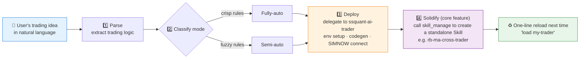

# 🏭 SSQuant Trader Generator (ssquant-trader-generator)

[简体中文](README.md) | **English**

> Say your idea once, get an AI trader you can reload anytime.

<p align="center">
  
  
  
  
  
</p>

---

## 📖 Introduction

**`ssquant-trader-generator`** is the **"factory"** for AI traders.

Its core responsibility is not just executing a one-off trading task, but turning a user's natural-language trading idea into a **permanent, reusable, dedicated Skill file**.

## 🎯 Goal

Let the user state an idea once and receive an AI-trader tool that can be invoked anytime in the future.

## 🔄 Workflow



1.  **Parse**: receive the user's natural-language description and extract the trading logic.
2.  **Classify**: decide fully-auto vs semi-auto mode and assign tasks.
3.  **Deploy**: delegate to `ssquant-ai-trader` for environment setup, code generation, and SIMNOW connection.
4.  **Solidify (core feature)**: call `skill_manage` to create the trader's standalone Skill file (e.g. `rb-ma-cross-trader`), making it a persistent part of the system.

## 🤝 Relationship with `ssquant-ai-trader`

| Role | Responsibility |
|---|---|
| 🏭 **`ssquant-trader-generator`** (factory, this repo) | High-level intent understanding, task orchestration, **persistent Skill generation** |
| ⚙️ [`ssquant-ai-trader`](https://github.com/quantskills/skill-ssquant-ai-trader) (engine) | Low-level code generation, data fetching, trade execution, monitoring & notifications |

## ✨ Features

1.  **Persistence**: generated Skill files are saved in the skills directory; loading one next time restores the trader immediately.
2.  **Platform-adaptive**: whether running on Hermes, Claude Code, or Cursor, it automatically finds the correct path to save the Skill.
3.  **Version pinning**: requires SSQuant `>= 0.4.6` so generated strategies stay compatible with the latest features.

## 📂 Directory Layout

```text
ssquant-trader-generator/
└── SKILL.md          # Core instruction file (read by the Agent)
```

## 🚀 Usage Example

**User**: "Turn this trading idea into an automated trader that I can reload anytime."

**AI (with this Skill loaded)**:

1.  Calls the Generator to parse the rules.
2.  Delegates to `ssquant-ai-trader` to deploy the strategy on SIMNOW.
3.  **Auto-generates** `skills/quant-trading/my-trader/SKILL.md`.
4.  Tells the user: "✅ Trader created! Next time just say 'load my-trader'."

## ⚠️ Disclaimer

Traders produced by this skill deploy to the SIMNOW **paper-trading** environment only. Nothing here constitutes live-trading investment advice.

## 📄 License

This project is licensed under the GNU General Public License v3.0. See [LICENSE](LICENSE).
