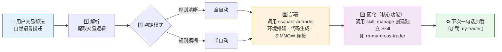

# 🏭 SSQuant Trader Generator (ssquant-trader-generator)

**简体中文** | [English](README.en.md)

> 说一次想法，得到一个可以随时加载的 AI 交易员。

<p align="center">
  
  
  
  
  
</p>

---

## 📖 简介

**`ssquant-trader-generator`** 是 AI 交易员的**"制造工厂"**。

它的核心职责不仅仅是执行一次交易任务，而是将用户的自然语言交易想法**转化为一个永久存在的、可复用的专属 Skill 文件**。

## 🎯 目标

让用户只需说一次想法，就能得到一个可以在未来随时调用的 AI 交易员工具。

## 🔄 工作流程



1.  **解析**: 接收用户自然语言描述，提取交易逻辑。
2.  **判定**: 判断全自动/半自动模式，分配任务。
3.  **部署**: 调用 `ssquant-ai-trader` 进行环境搭建、代码生成与 SIMNOW 连接。
4.  **固化 (核心功能)**: 调用 `skill_manage` 创建该交易员的独立 Skill 文件（如 `rb-ma-cross-trader`），使其成为系统的一部分。

## 🤝 与 `ssquant-ai-trader` 的关系

| 角色 | 职责 |
|---|---|
| 🏭 **`ssquant-trader-generator`**（工厂，本仓库） | 上层意图理解、任务编排、**持久化 Skill 的生成** |
| ⚙️ [`ssquant-ai-trader`](https://github.com/quantskills/skill-ssquant-ai-trader)（引擎） | 底层代码生成、数据拉取、交易执行、监控推送 |

## ✨ 特性

1.  **持久化**: 生成的 Skill 文件会保存在技能目录中，下次加载即可直接恢复交易员运行。
2.  **平台自适应**: 无论运行在 Hermes、Claude Code 还是 Cursor，都能自动找到正确的路径保存 Skill。
3.  **版本锁定**: 强制要求 SSQuant `>= 0.4.6` 环境，确保生成的策略兼容最新特性。

## 📂 目录结构

```text
ssquant-trader-generator/
└── SKILL.md          # 核心指令文件 (Agent 读取)
```

## 🚀 使用示例

**用户**: "帮我把这个交易想法做成一个自动交易员，以后我能随时加载它。"

**AI (加载此 Skill 后)**:

1.  调用 Generator 解析规则。
2.  委托 `ssquant-ai-trader` 部署策略到 SIMNOW。
3.  **自动生成** `skills/quant-trading/my-trader/SKILL.md`。
4.  告知用户："✅ 交易员已生成！下次只需说'加载 my-trader'。"

## ⚠️ 免责声明

本技能生成的交易员仅部署 SIMNOW **模拟盘**，输出不构成任何实盘投资建议。

## 📄 许可证

本项目使用 GNU General Public License v3.0，详见 [LICENSE](LICENSE)。
